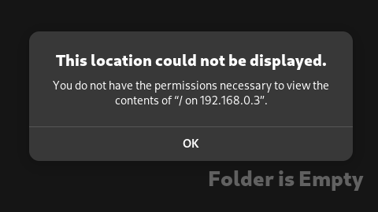

# gsconnect-mount-manager

## Table of contents
- [Info](#Info)
- [Issue this project solves:](#issue-this-project-solves)
- [Working example:](#working-example)
- [Requirements:](#requirements)
- [Installation:](#installation)
- [Remove:](#remove)
- [Update:](#update)
- [Tested on:](#tested-on)
- [Known issues:](#known-issues)
- [TODO:](#todo)

# Info:
Extends the functionality of the gsconnect gnome extension to mount and unmount android phone's storage.

# Issue this project solves:


# Working example:


# Requirements:
[dbus-python](https://archlinux.org/packages/extra/x86_64/dbus-python/)

dconf (it most likely comes with your gnome installation)

# Installation:
1. clone the repo
2. run `install.sh`

```bash
git clone https://github.com/fjueic/gsconnect-mount-manager.git
cd gsconnect-mount-manager
chmod +x install.sh
sudo ./install.sh
```

# Remove:
Reinstall the gsconnect extension.

# Update:
Reinstall the gsconnect extension and follow the installation steps again.

# Tested on:
- Arch Linux(Gnome)
- Manjaro
- Garuda Linux
- Pop OS
- Fedora

# Known issues:
- [ ] doesn't work if wifi and hotspot are both ON at the same time on your android phone. For now i don't plan to fix this issue because i don't need it.


# TODO:
- [ ] i was unable to use gsettings because of some kind of schema issue and stackoverflow was not helpful. so i used dconf instead. i don't know if it is a good idea or not but it works. i will try to find a way to use gsettings.

- [ ] paths are generated using + operator. i check later for alternatives of os.path.join for javascript
